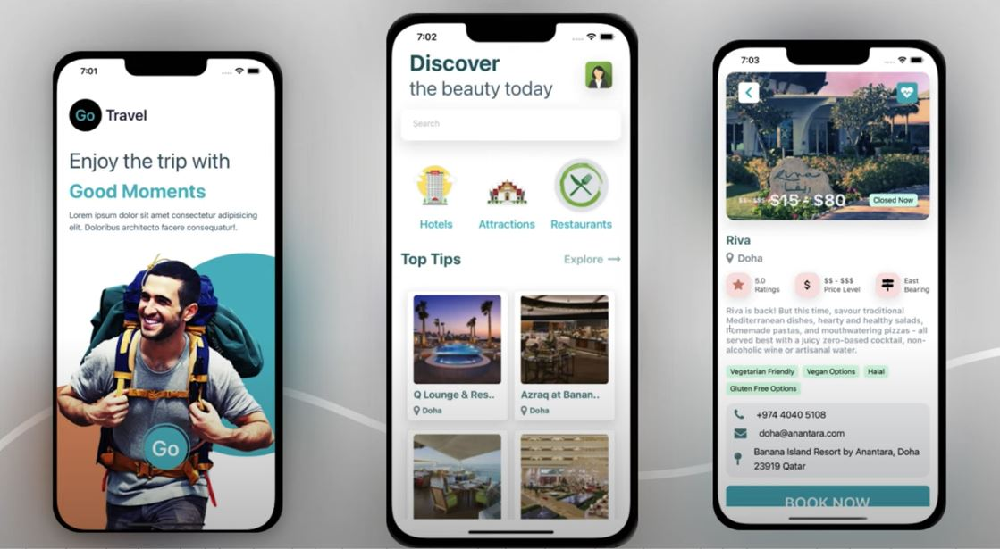

# GoTravel - A React Native travel app

> Explore attractions, hotels, and restaurants in your city or any city in the world.

## Description

This is a mobile app that allows users to explore attractions, hotels, and restaurants in their city or any city in the world using Google places API.

## Instructions

### Cloning the repo to your local system (if you already have git, installed in your system)

1. Copy this Link `https://github.com/Hombre2014/GoTravel.git`
2. Open your terminal or command line
3. Run the command: `git clone https://github.com/Hombre2014/GoTravel.git`
4. Open the folder with your code editor: `cd GoTravel`
5. Run `yarn start` to start the server
6. Scan the QR code with your phone or run the app in an emulator

## Built With

- Major languages: JavaScript
- Frameworks: React Native, Tailwind CSS
- Google places API

## Features

- Explore attractions, hotels, and restaurants in your city or any city in the world

## Screenshots

## Deployment

- All the files necessary for deployment are in the /dist folder

## Author

👤 **Yuriy Chamkoriyski**

- GitHub: [@Hombre2014](https://github.com/Hombre2014)
- Twitter: [@Chamkoriyski](https://twitter.com/Chamkoriyski)
- LinkedIn: [axebit](https://linkedin.com/in/axebit)

## 🤝 Contributing

Contributions, issues, and feature requests are welcome!

Feel free to check the [issues page](https://github.com/Hombre2014/GoTravel.git/issues).

## Attribution

Thanks to Vetrivel Ravi and his inspirational video: [Go Travel](https://www.youtube.com/watch?v=JqPezeQiwxk&t=10s&ab_channel=VetrivelRavi).

## Show your support

Give a ⭐️ if you like this project!

## 📝 License

This project is [MIT](./license.md) licensed.
